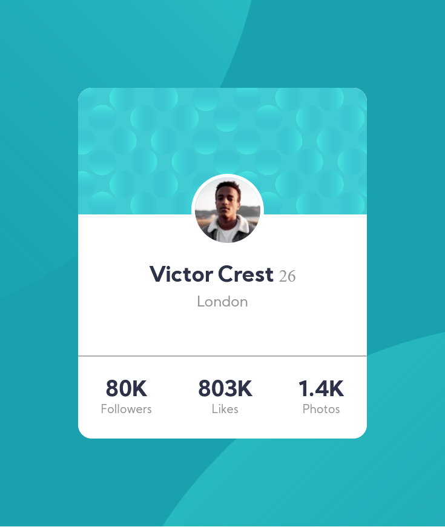

# Frontend Mentor - Profile card component solution

This is a solution to the [Profile card component challenge on Frontend Mentor](https://www.frontendmentor.io/challenges/profile-card-component-cfArpWshJ). Frontend Mentor challenges help you improve your coding skills by building realistic projects. 

## Table of contents

- [Overview](#overview)
  - [The challenge](#the-challenge)
  - [Screenshot](#screenshot)
  - [Links](#links)
  - [Built with](#built-with)
- [Author](#author)

## Overview
This is one of the difficult project i have build. The difficult part is to set the profile image with background and also set it so perfect that it will become responsive also.

### The challenge

- Set the profile image with background.
- Make it responsive.

### Screenshot

### Links

- Solution URL: [Github](https://github.com/abno-24/Profile-Card)
- Live Site URL: [Github Pages](https://abno-24.github.io/Profile-Card/)

### Built with

- Semantic HTML5 markup
- CSS custom properties
- Flexbox

## Author

- Website - [Portfolio](https://abno-24.github.io/Portfolio/)
- Frontend Mentor - [@abno-24](https://www.frontendmentor.io/profile/abno-24)
- Twitter - [@abno_24](https://twitter.com/abno_24)